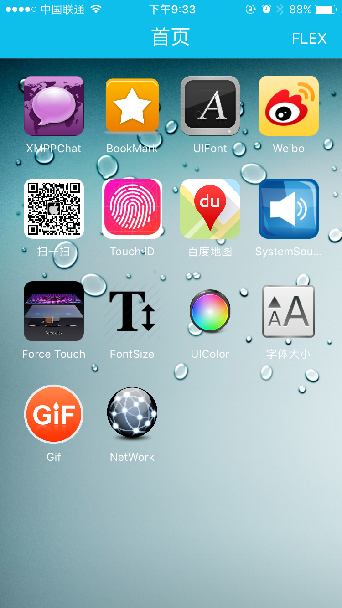
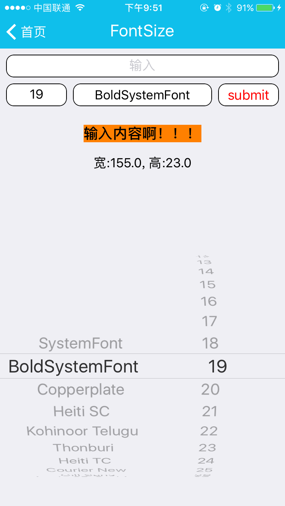
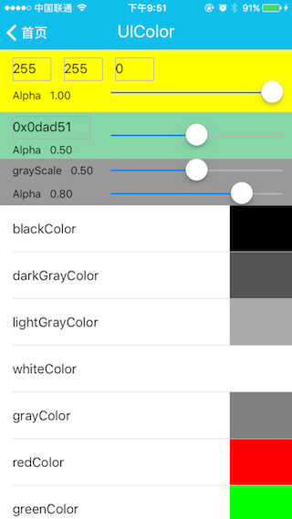
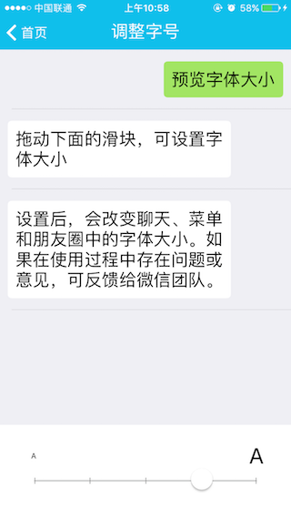
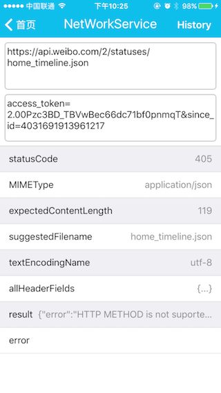
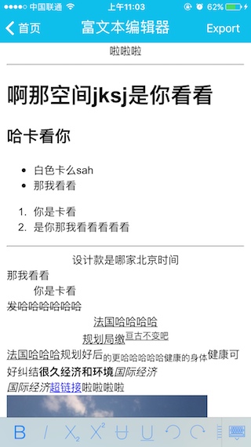

# FLOAPP

### 一个用于自我技术积累的项目，持续更新...

1. slideMenu -- 侧滑菜单 -- 2015.11.20
2. 聊天 -- [FloXMPP](https://github.com/flolangka/FLOXMPP)通过XMPP实现的即时通讯应用 -- 2015.11.30
3. UIFont -- 系统字体库 -- 2015.12.4
4. bookMark -- 书签(浏览器)-- 2015.12.14
5. sinaWeibo -- 曾经做的微博练习，将首页部分融入其中 -- 2015.12.16
6. 扫一扫 -- AVFoundation实现扫码功能 -- 2015.12.17
7. 桌面3D Touch -- 2015.12.17
8. Touch ID -- 2015.12.21
9. 百度地图 -- 2015.12.25
10. SystemSound -- 2015.12.31
11. FLEX -- 2016.1.4
12. Force-Touch -- 2016.1.14
13. WKWebView -- 2016.1.14
14. FontSize -- 2016.5.10
15. UIColor  --  2016.8.16
16. 字体大小调整  --  2016.8.25
17. 相册Gif文件浏览  --  2016.8.26
18. 网络请求（测试接口） --  2016.9.4
19. CoreData (存储网络请求历史)  --  2016.9.6
20. Action Extension  --  2016.12.1
21. 瀑布流  --  2016.12.22
22. 流媒体  --  2017.1.4
23. 排序  --  2017.1.5 [源：AllKindsOfSortForiOS](https://github.com/lizelu/DataStruct-Swift/tree/master/AllKindsOfSortForiOS)
24. 通知(NotificationContentExtension & NotificationServiceExtension)  --  2017.2.11
25. ReactNative  —  2017.4.5
26. 后台下载、断点续传  —  2017.4.17
27. Widget  --  2017.4.19
28. 富文本编辑器	--	 2017.4.21 [源：ZSSRichTextEditor](https://github.com/nnhubbard/ZSSRichTextEditor)

### Noti:
[ReactiveCocoa](https://github.com/ReactiveCocoa/ReactiveObjC) 是作为 [submodule](https://git-scm.com/book/en/v2/Git-Tools-Submodules) 添加到项目中的，so有2种clone方法：
###### 1
```
git clone --recurse-submodules https://github.com/flolangka/FLOAPP.git
```
###### 2
```
git clone https://github.com/flolangka/FLOAPP.git
git submodule init
git submodule update
```

### 截图：

	






	




#### BY [Flolangka](http://flolangka.com)
